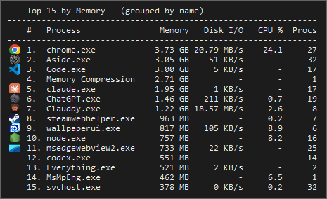

# Peek

Press a hotkey, get an instant overlay of your top processes. It appears next to
the cursor, refreshes while it is up, and disappears on its own.



## Install

Download `Peek.exe` from the [latest release](../../releases/latest) and run it.
No installer, no dependencies. Settings are written to `Peek.ini` next to the
executable, and nothing else on the machine is touched.

## Use

- **Ctrl + Shift + X** toggles the overlay. The combination is changeable.
- Right-click the tray icon for: Peek now, Settings, Check for updates, Restart
  as administrator, Reload, Exit. Everything else lives in the settings window.

## Settings

| | |
|---|---|
| Hotkey | Captured by pressing the combination you want |
| Sort by | Network rate, network session, memory, disk I/O or CPU |
| Columns | Any combination, shown side by side |
| Show | 5, 10, 15 or 20 rows |
| Stays up | 3, 5 or 10 seconds, or until the hotkey is pressed again |
| Refresh | How fast the overlay re-samples while on screen |
| Follow cursor | Drag with the mouse, or stay where it opened |
| Group by name | 40 `chrome.exe` processes collapse into one row |
| Show icons | Each row gets the executable's own icon |
| Dark theme | Dark or light overlay |
| Session totals | Whether byte totals keep counting while the overlay is closed |
| Start with Windows | A logon task that starts Peek already elevated |
| Updates | Whether to ask GitHub for a newer release once a day, plus "Check now" |

`Net *` columns are live rates. `Sess *` columns are total bytes each process
has moved since Peek was started.

## Updates

Peek can update itself. "Check for updates" in the tray menu, or "Check now" in
the settings window, asks GitHub for the newest release; with the box in the
settings window ticked it also asks once a day on its own and only speaks up
when there is something newer. Drafts and prereleases are ignored, and a version
you press **Skip** on stays quiet until a newer one appears.

Pressing **Install** downloads `Peek.exe` from the release, checks it against the
size and SHA-256 that GitHub publishes for it, and only then replaces the running
executable. The swap itself is done after Peek exits, because Windows holds a
lock on a running program, and Peek starts itself again afterwards. The previous
executable is kept as `Peek.exe.old` until the new one has started.

If "Start with Windows" is on, the logon task is re-registered for the new
executable in the same step. That needs administrator rights, so an update will
ask for consent once when the task exists, or when Peek sits somewhere its own
folder is not writable.

Running from `Peek.ahk` rather than the compiled exe, there is nothing to
replace: the release page is opened instead.

## Administrator rights

Per-process network figures need elevation, because the TCP EStats API refuses
to enable byte collection otherwise. Memory, disk I/O, CPU and process counts
all work without it.

A Startup-folder shortcut cannot launch an elevated program, since Windows has
no "remember this" for UAC and would prompt at every boot. "Start with Windows"
registers a scheduled task instead, so booting never prompts.

## Idle cost

The process table is only read while the overlay is on screen. The one thing
that runs in the background is a TCP scan every couple of seconds, and only so
the `Sess *` totals do not miss bytes moved between peeks. Clear "Keep counting
while the overlay is closed" in settings for zero idle cost.

The update check is the other thing on a timer, but it is one request a day and
only if you leave it on.

## Build from source

Requires [AutoHotkey v2](https://www.autohotkey.com/).

```
"C:\Program Files\AutoHotkey\Compiler\Ahk2Exe.exe" /in Peek.ahk /out Peek.exe ^
    /base "C:\Program Files\AutoHotkey\v2\AutoHotkey64.exe"
```

## License

[GNU General Public License v3.0](LICENSE). Use it anywhere, commercially or
privately, and modify it however you like. If you distribute it or anything
derived from it, the source has to be published under the same license.
